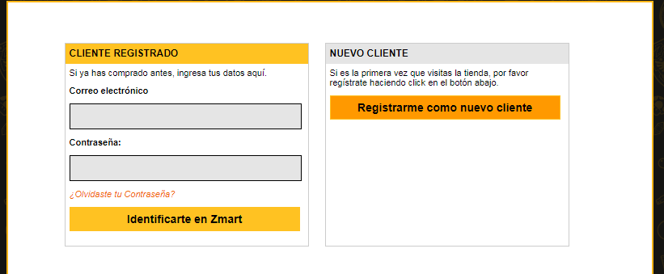
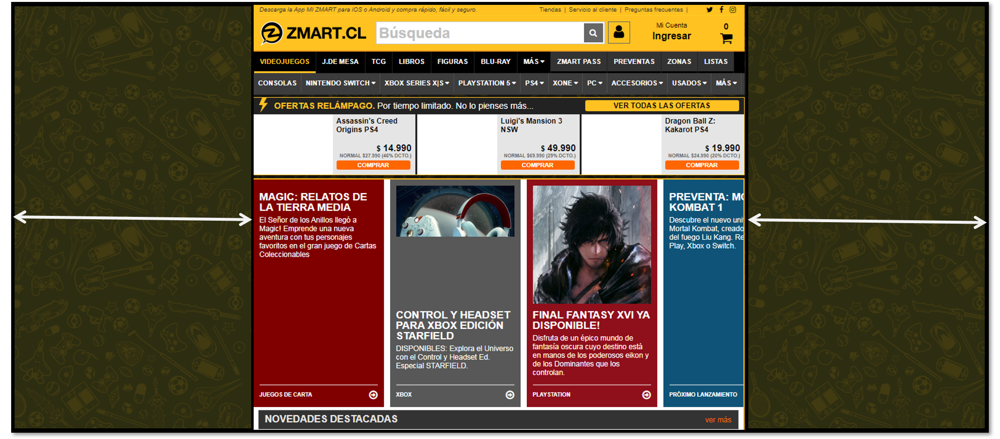
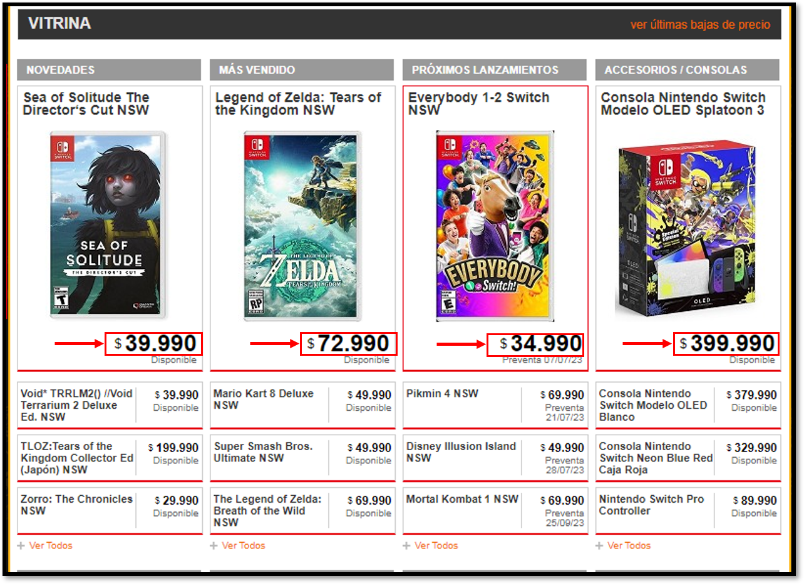
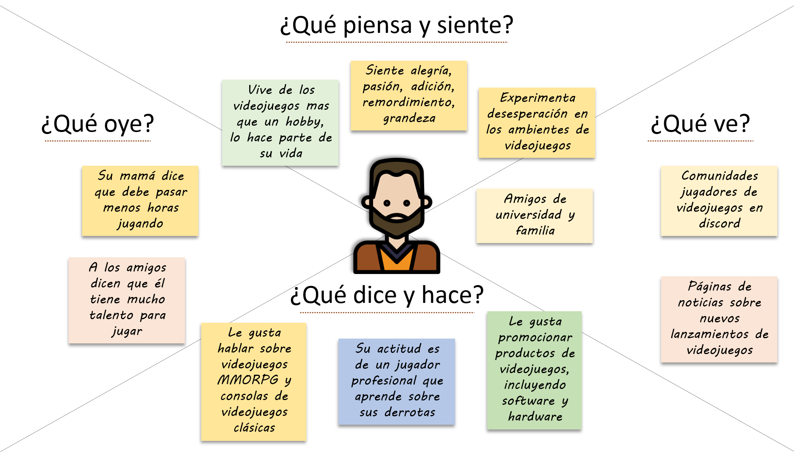
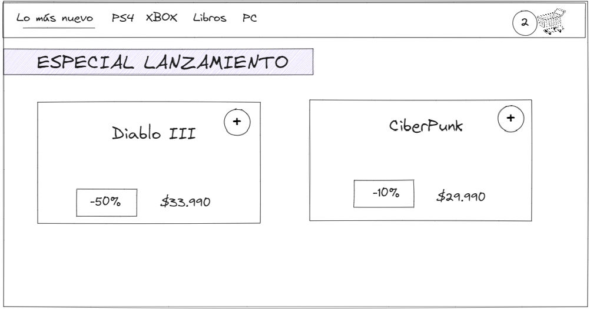

## Caso de estudio ZMART

---

## 1. Identificar quienes son los usuarios del producto

Siguiendo en la investigación del producto, elegimos el rubro de *e-commerce*, nos enfocamos en recolectar información por medio de entrevistas informales basada en la experiencias de los usuarios del sitio web [zmart.cl](https://www.zmart.cl/) que nos dicen lo siguiente:

-  **Problema para poder realizar la compra**

para efectuar una compra el usuario se debe registrarse cosa que es muy invasiva, tampoco ofrece opciones de registrarse con **google**, **facebook**, etc.

---

- **Problemas de diseño encontrado**

Mal uso del espaciado de la página para mostrar los productos.

---

- **Problemas con los colores de precios**

Precios de juegos destacados aparecen con el mismo color que los juegos disponibles.

---

## Nuestros usuarios

A base de la investigación por medio de las entrevistas y la información de las personas que fueron entrevistadas podemos identificar que nuestros usuarios son:

- Jóvenes estudiantes entre 18 y 32 años con alto nivel competitivo y habilidades para los videojuegos de tipo shooter 
- Personas mayores de 40 años con un alto sentimiento de nostalgia hacia los videojuegos retro clásicos y con capacidad económica para comprar artículos físicos para sumar a su colección
- Personas menores de 18 años (menores de edad), que tienen acceso a un smartphone y gastan dinero con el conocimiento de los padres en videojuegos que aceptan micropagos y supcripciones online, de estos videojuegos se destaca el título **Roblox**

---

## 2. Empatizar con los usuarios (mapa de empatía)

---

## 3. Crear la User Persona del perfil de usuario específico

---

## 4. Ideas de mejoras que permiten solucionar los problemas listado anteriormente

de las lluvia de ideas por parte de nuestro equipo y en consecuencia del resultado de las entrevistas con los stakeholders, las ideas que sobresalen e impactan más para la solución a los problemas anteriores son las siguientes:

- Diseñar un sitio web que sea más atractivo,  mejorando los elementos como el rendimiento, la funcionalidad y la apariencia (evitando los errores de [zmart](https://www.zmart.cl)).
- Añadir métodos de registros alternativos a los convencionales (**google**, **facebook**, etc).
- Definir un color y tamaño adecuado para los precios que acompañan el producto según su categoría, un juego que tiene precio especial por lanzamiento, debe resaltar y ser de un color diferente al resto del catálogo disponible.

---

## 5. Materializar las solución ideada en un prototipo

El tipo de prototipo a utilizar es el diseño renovado del sitio web, para conocer la manera en que el usuario interactua con el producto.

