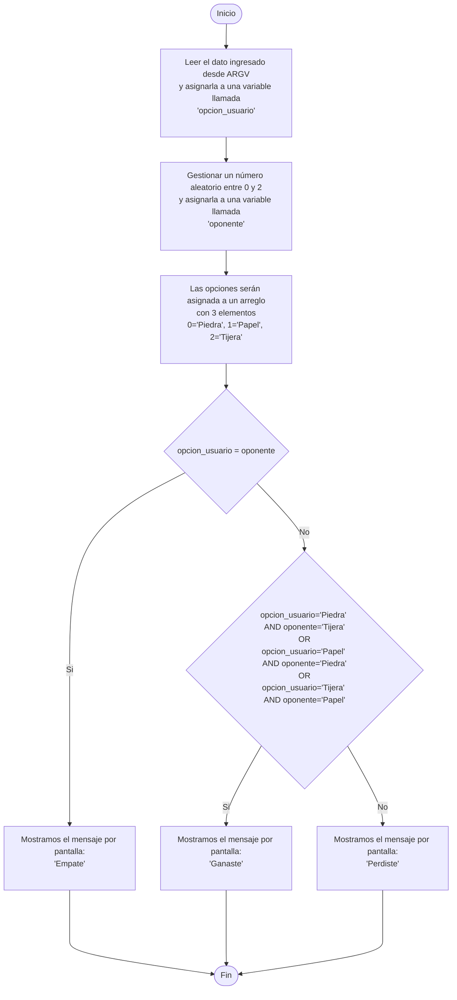

## Desafío evaluado - Flujo, ciclos y Métodos (I) : Piedra Papel o Tijera

- **Módulo**: Introducción a la programación con Ruby 
- **Programa**: Desarrollo Ruby on Rails para emprendimientos de tipo Startup - 0047

---

## Algoritmo

---

### Despliegue 

### Uso

